# System Architecture Diagram

Below is a comprehensive architecture diagram showing the layered structure of the application, including all components and their relationships.

```mermaid
graph TB
    %% Main Application Layers
    subgraph "Client Layer"
        Browser["Web Browser"]
    end

    subgraph "Frontend Layer (Next.js)"
        NextApp["Next.js Application"]
        
        subgraph "UI Components"
            HomePage["HomePage Component"]
            Dashboard["AdaptiveDashboard Component"]
            CollateralViz["CollateralWebVisualization"]
            CollateralAnalysis["CollateralAnalysis Component"]
            CollateralDetails["CollateralDetails Component"]
            CollateralForm["CollateralForm Component"]
            CollateralSearch["CollateralSearch Component"]
            ScenarioManager["ScenarioManager Component"]
            CollateralObj["CollateralObjectView Component"]
            LoanObj["LoanObjectView Component"]
            WebOfLiability["CollateralWebOfLiability Component"]
            DataWizard["DataWizard Component"]
        end
        
        subgraph "Frontend Services"
            APIService["API Services"]
            AuthService["Authentication Service"]
        end
        
        subgraph "Custom Hooks"
            useAuth["useAuth Hook"]
            useScenario["useScenario Hook"]
            useCollateral["useCollateral Hook"]
            useAnalysis["useAnalysis Hook"]
        end
    end

    subgraph "Backend Layer (Node.js, Express)"
        ExpressServer["Express Server"]
        
        subgraph "API Routes"
            REST["RESTful API Endpoints"]
        end
        
        subgraph "GraphQL API Layer"
            GraphQLServer["GraphQL Server (Apollo)"]
            
            subgraph "GraphQL Schemas"
                CustomerSchema["Customer Schema"]
                CollateralSchema["Collateral Schema"]
                LoanSchema["Loan Schema"]
                ScenarioSchema["Scenario Schema"]
                AnalysisSchema["Analysis Schema"]
            end
            
            subgraph "GraphQL Resolvers"
                CustomerResolver["Customer Resolver"]
                CollateralResolver["Collateral Resolver"]
                LoanResolver["Loan Resolver"]
                ScenarioResolver["Scenario Resolver"]
                AnalysisResolver["Analysis Resolver"]
            end
        end
        
        subgraph "Backend Controllers"
            CollateralController["Collateral Controller"]
            ScenarioController["Scenario Controller"]
            AnalysisController["Analysis Controller"]
        end
        
        subgraph "Backend Services"
            CollateralService["Collateral Service"]
            ScenarioService["Scenario Service"]
            AnalysisService["Analysis Service"]
        end
        
        subgraph "Middleware"
            AuthMiddleware["Authentication Middleware"]
            ValidatorMiddleware["Validation Middleware"]
        end
    end

    subgraph "AI Agents Layer"
        subgraph "Collateral Analysis Agent"
            CollateralAgentMain["CollateralAnalysisAgent"]
            ValueModel["ValueEstimationModel (PyTorch)"]
            RiskModel["RiskAssessmentModel (RL)"]
            MarketAnalyzer["MarketAnalyzer"]
            DecisionOptimizer["DecisionOptimizer"]
        end
    end

    subgraph "Database Layer"
        PrismaORM["Prisma ORM"]
        PostgresDB["PostgreSQL Database"]
        
        subgraph "Data Models"
            CustomerModel["Customer"]
            LoanModel["Loan"]
            CollateralModel["Collateral"]
            ScenarioModel["Scenario"]
            SecurityDocModel["SecurityDocument"]
            ValuationModel["CollateralValuation"]
            GroupModel["CollateralGroup"]
        end
    end

    subgraph "Infrastructure Layer (AWS)"
        VPC["AWS VPC"]
        ECS["AWS ECS/Fargate"]
        RDS["AWS RDS (PostgreSQL)"]
        S3["AWS S3 (Document Storage)"]
        Cognito["AWS Cognito (Auth)"]
        CloudWatch["AWS CloudWatch (Monitoring)"]
    end

    %% Connections between components

    %% Client to Frontend connections
    Browser --> NextApp

    %% Frontend component connections
    NextApp --> HomePage
    NextApp --> Dashboard
    Dashboard --> CollateralViz
    Dashboard --> CollateralAnalysis
    Dashboard --> ScenarioManager
    CollateralViz --> CollateralObj
    CollateralViz --> LoanObj
    CollateralViz --> WebOfLiability
    NextApp --> CollateralDetails
    NextApp --> CollateralForm
    NextApp --> CollateralSearch
    NextApp --> DataWizard

    %% Frontend to Frontend Service connections
    HomePage --> APIService
    CollateralViz --> APIService
    CollateralDetails --> APIService
    CollateralForm --> APIService
    CollateralSearch --> APIService
    ScenarioManager --> APIService
    CollateralAnalysis --> APIService
    NextApp --> AuthService

    %% Hook connections
    CollateralViz --> useCollateral
    CollateralDetails --> useCollateral
    CollateralForm --> useCollateral
    ScenarioManager --> useScenario
    CollateralAnalysis --> useAnalysis
    HomePage --> useAuth
    APIService --> useAuth

    %% Frontend to Backend connections
    APIService --> ExpressServer
    APIService --> GraphQLServer

    %% Backend internal connections
    ExpressServer --> REST
    ExpressServer --> GraphQLServer
    ExpressServer --> AuthMiddleware
    ExpressServer --> ValidatorMiddleware
    
    REST --> CollateralController
    REST --> ScenarioController
    REST --> AnalysisController
    
    GraphQLServer --> CustomerSchema
    GraphQLServer --> CollateralSchema
    GraphQLServer --> LoanSchema
    GraphQLServer --> ScenarioSchema
    GraphQLServer --> AnalysisSchema
    
    CustomerSchema --> CustomerResolver
    CollateralSchema --> CollateralResolver
    LoanSchema --> LoanResolver
    ScenarioSchema --> ScenarioResolver
    AnalysisSchema --> AnalysisResolver
    
    CustomerResolver --> CollateralService
    CollateralResolver --> CollateralService
    LoanResolver --> CollateralService
    ScenarioResolver --> ScenarioService
    AnalysisResolver --> AnalysisService
    
    CollateralController --> CollateralService
    ScenarioController --> ScenarioService
    AnalysisController --> AnalysisService

    %% Backend to AI Agent connections
    AnalysisService --> CollateralAgentMain
    CollateralAgentMain --> ValueModel
    CollateralAgentMain --> RiskModel
    CollateralAgentMain --> MarketAnalyzer
    CollateralAgentMain --> DecisionOptimizer

    %% Service to Database connections
    CollateralService --> PrismaORM
    ScenarioService --> PrismaORM
    AnalysisService --> PrismaORM
    PrismaORM --> PostgresDB
    
    %% Database connections
    PostgresDB --> CustomerModel
    PostgresDB --> LoanModel
    PostgresDB --> CollateralModel
    PostgresDB --> ScenarioModel
    PostgresDB --> SecurityDocModel
    PostgresDB --> ValuationModel
    PostgresDB --> GroupModel
    
    %% Infrastructure connections
    VPC --> ECS
    VPC --> RDS
    VPC --> S3
    VPC --> Cognito
    VPC --> CloudWatch
    ECS --> ExpressServer
    RDS --> PostgresDB
    S3 --> CollateralService
    Cognito --> AuthService
    CloudWatch --> ExpressServer

    %% Style configurations
    classDef clientLayer fill:#f9f9f9,stroke:#333,stroke-width:1px
    classDef frontendLayer fill:#e6f3ff,stroke:#333,stroke-width:1px
    classDef backendLayer fill:#e6ffe6,stroke:#333,stroke-width:1px
    classDef aiLayer fill:#ffebe6,stroke:#333,stroke-width:1px
    classDef dbLayer fill:#f2e6ff,stroke:#333,stroke-width:1px
    classDef infraLayer fill:#fff2e6,stroke:#333,stroke-width:1px
    
    class Browser clientLayer
    class NextApp,HomePage,Dashboard,CollateralViz,CollateralAnalysis,CollateralDetails,CollateralForm,CollateralSearch,ScenarioManager,CollateralObj,LoanObj,WebOfLiability,DataWizard,APIService,AuthService,useAuth,useScenario,useCollateral,useAnalysis frontendLayer
    class ExpressServer,REST,GraphQLServer,CustomerSchema,CollateralSchema,LoanSchema,ScenarioSchema,AnalysisSchema,CustomerResolver,CollateralResolver,LoanResolver,ScenarioResolver,AnalysisResolver,CollateralController,ScenarioController,AnalysisController,CollateralService,ScenarioService,AnalysisService,AuthMiddleware,ValidatorMiddleware backendLayer
    class CollateralAgentMain,ValueModel,RiskModel,MarketAnalyzer,DecisionOptimizer aiLayer
    class PrismaORM,PostgresDB,CustomerModel,LoanModel,CollateralModel,ScenarioModel,SecurityDocModel,ValuationModel,GroupModel dbLayer
    class VPC,ECS,RDS,S3,Cognito,CloudWatch infraLayer
```

## Architecture Overview

The system architecture follows a layered approach with six main components:

1. **Client Layer**: The web browser interface that users interact with
2. **Frontend Layer**: Built with Next.js, containing UI components, services, and custom hooks
3. **Backend Layer**: Node.js and Express server with RESTful and GraphQL APIs
4. **AI Agents Layer**: Contains the Collateral Analysis Agent with PyTorch and RL models
5. **Database Layer**: PostgreSQL with Prisma ORM for data management
6. **Infrastructure Layer**: AWS services (VPC, ECS, RDS, S3, Cognito, CloudWatch)

Each layer communicates with adjacent layers through well-defined interfaces, creating a modular and scalable architecture.
