# System Architecture Overview

This document provides a visual representation of our system architecture using a Mermaid diagram.

## Architecture Diagram

```mermaid
graph LR
    %% High-level system overview with main layers
    Client["Client Layer\n(Web Browser)"]
    Frontend["Frontend Layer\n(Next.js)"]
    Backend["Backend Layer\n(Node.js, Express, GraphQL)"]
    AIAgents["AI Agents Layer\n(PyTorch, RL Models)"]
    Database["Database Layer\n(PostgreSQL, Prisma)"]
    Infra["Infrastructure Layer\n(AWS Services)"]

    %% Connections between main layers
    Client -->|User Interaction| Frontend
    Frontend -->|API Requests| Backend
    Backend -->|Query/Update| Database
    Backend -->|Analysis Requests| AIAgents
    AIAgents -->|Analysis Results| Backend
    AIAgents -->|Data Access| Database
    Database -->|Hosted On| Infra
    Backend -->|Deployed On| Infra
    Frontend -->|Authentication| Infra

    %% Styling
    classDef client fill:#E9F7EF,stroke:#27AE60,color:#000000
    classDef frontend fill:#D4E6F1,stroke:#3498DB,color:#000000
    classDef backend fill:#EBF5FB,stroke:#2E86C1,color:#000000
    classDef ai fill:#FDEDEC,stroke:#E74C3C,color:#000000
    classDef database fill:#F4ECF7,stroke:#8E44AD,color:#000000
    classDef infra fill:#FEF9E7,stroke:#F1C40F,color:#000000

    class Client client
    class Frontend frontend
    class Backend backend
    class AIAgents ai
    class Database database
    class Infra infra
```

## Description

The diagram above illustrates the layered architecture of our system:

1. **Client Layer** - Web browser interface for end users
2. **Frontend Layer** - Built with Next.js for responsive UI
3. **Backend Layer** - Node.js and Express with GraphQL API
4. **AI Agents Layer** - Machine learning models built with PyTorch for data analysis
5. **Database Layer** - PostgreSQL database with Prisma ORM
6. **Infrastructure Layer** - AWS services supporting the entire system

Each component is color-coded for easy identification, and the connections between layers show the primary interaction patterns in the system.
