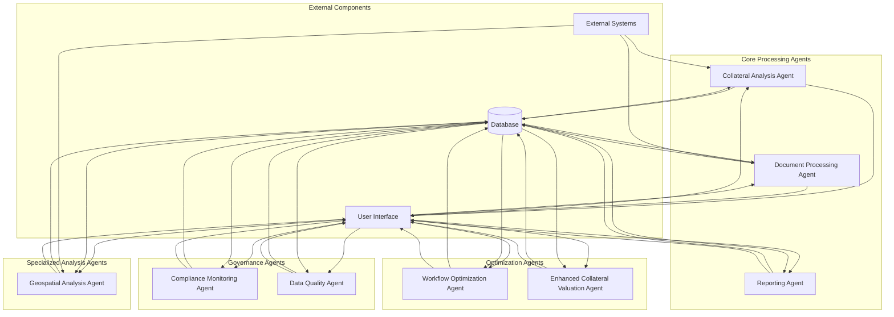
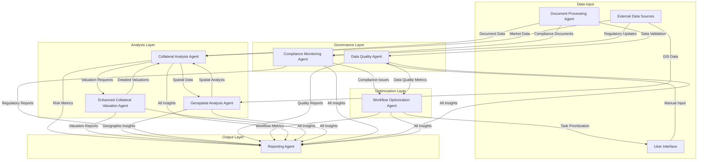
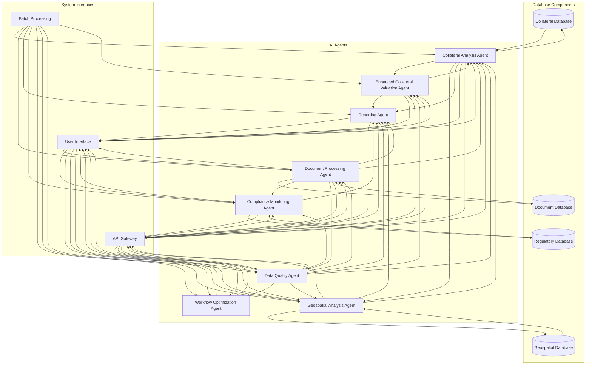
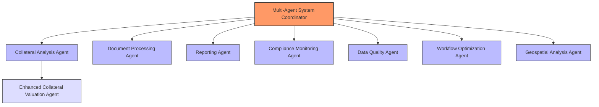
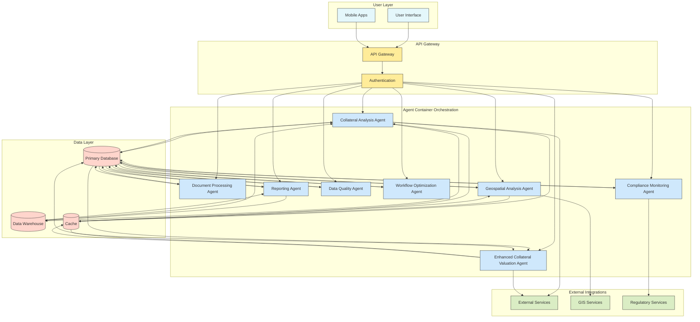
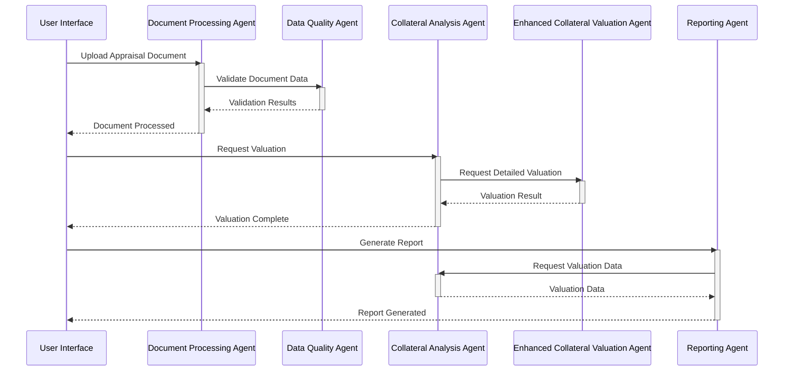

# Agentic Architecture Diagrams

This document provides visual representations of the AI agent architecture for the Farm Credit Collateral Management System.

## Agent Ecosystem Overview

## Agent Interaction Flows

## Agent Integration with System Components

## Agent Hierarchical Organization

## Agent Deployment Architecture

## Agent Implementation Communication Protocol

