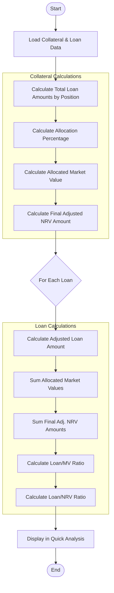

# Farm Credit Collateral Management System
# PRD Visualizations

This document contains the visual representations of the system architecture, user flows, and relationship models for the Farm Credit Collateral Management System using Mermaid diagrams.

## System Architecture

## User Workflow - Collateral Creation

## Web of Liability - Component Relationships

## Collateral Data Model

## User Interface Layout - Home Page

## Collateral Wizard Workflow

## Quick Loan Analysis Calculation Flow

## Implementation Phases Timeline

