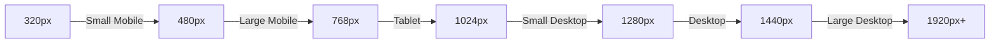
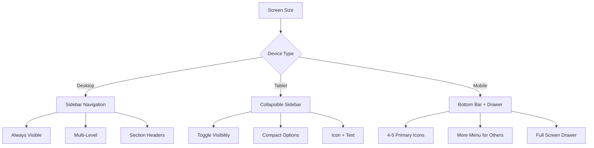

# Farm Credit Collateral Management System
## Responsive Design Specifications

This document outlines how the Farm Credit Collateral Management System adapts to different device sizes and orientations, ensuring a consistent and optimal user experience across platforms.

## Table of Contents
1. [Responsive Design Philosophy](#responsive-design-philosophy)
2. [Breakpoint System](#breakpoint-system)
3. [Grid System](#grid-system)
4. [Key Screen Adaptation Examples](#key-screen-adaptation-examples)
5. [Navigation Patterns](#navigation-patterns)
6. [Touch Optimization](#touch-optimization)
7. [Performance Considerations](#performance-considerations)

---

## Responsive Design Philosophy

The Farm Credit Collateral Management System follows a "progressively enhanced" responsive approach:

1. **Mobile-First Design**: Core functionality is designed for mobile first, then enhanced for larger screens
2. **Progressive Disclosure**: Complex features are revealed progressively as screen real estate increases
3. **Consistent Experience**: Core workflows remain consistent across devices
4. **Optimized Interactions**: Input methods are optimized for each device type (touch, keyboard/mouse)
5. **Performance Focus**: Performance is prioritized across all device capabilities

---

## Breakpoint System

The system uses the following standard breakpoints:



### Device Categories

1. **Mobile (320px-767px)**
   - Single-column layouts
   - Bottom navigation
   - Focused task flows
   - Critical features only

2. **Tablet (768px-1023px)**
   - Two-column layouts
   - Sidebar navigation (collapsible)
   - Expanded feature set
   - Touch-optimized controls

3. **Desktop (1024px+)**
   - Multi-column layouts
   - Persistent sidebar navigation
   - Full feature set
   - Advanced visualizations
   - Keyboard shortcuts

---

## Grid System

The interface uses a flexible grid system that adapts to screen size:

### Mobile Grid (320px-767px)
- 4-column grid
- 16px gutters
- 16px margins
- Single-column content areas

### Tablet Grid (768px-1023px)
- 8-column grid
- 24px gutters
- 24px margins
- 1-2 column content areas

### Desktop Grid (1024px+)
- 12-column grid
- 24px gutters
- 40px margins
- Multi-column content areas

---

## Key Screen Adaptation Examples

### Dashboard

```
DESKTOP (1024px+)
+----------------------------------------------------------+
| LOGO | Search                         | Notif | Profile  |
+------+----------------------------------------------+----+
|      |                                              |    |
|  N   | Quick Stats                     | Alerts    |    |
|  A   | [1] [2] [3] [4]                | [A] [B]   |    |
|  V   |                                              |  S |
|      | Recent Activity                              |  I |
|  B   | [Item 1]                                     |  D |
|  A   | [Item 2]                                     |  E |
|  R   | [Item 3]                                     |    |
|      |                                              |  P |
|      | Web of Liability (Mini View)                 |  A |
|      | [Visualization]                              |  N |
|      |                                              |  E |
|      |                                              |  L |
+------+----------------------------------------------+----+

TABLET (768px-1023px)
+------------------------------------------+
| LOGO | Search               | N | P | ≡ |
+------+-----------------------------+----+
|                                    |    |
| Quick Stats                        |    |
| [1] [2]                            |  S |
| [3] [4]                            |  I |
|                                    |  D |
| Recent Activity                    |  E |
| [Item 1]                           |    |
| [Item 2]                           |  P |
|                                    |  A |
| Web of Liability (Mini View)       |  N |
| [Visualization]                    |  E |
|                                    |  L |
+------------------------------------+----+

MOBILE (320px-767px)
+---------------------------+
| LOGO | Search       | ≡ |
+---------------------------+
|                           |
| Quick Stats               |
| [1]    [2]                |
| [3]    [4]                |
|                           |
| Recent Activity           |
| [Item 1]                  |
| [Item 2]                  |
|                           |
| Web of Liability          |
| [Simple Visualization]    |
|                           |
+---------------------------+
| Home | Search | Add | Profile |
+---------------------------+
```

### Collateral Detail View

```
DESKTOP (1024px+)
+----------------------------------------------------------+
| LOGO | Search                         | Notif | Profile  |
+------+----------------------------------------------+----+
|      |                                              |    |
|  N   | Collateral: Smith Farm                       |    |
|  A   | < Back to Search                             |    |
|  V   |                                              |  D |
|      | +------------------+  +------------------+   |  E |
|  B   | | Property Details |  | Valuation       |   |  T |
|  A   | | Address          |  | Current: $450K  |   |  A |
|  R   | | Acres: 50        |  | History [Graph] |   |  I |
|      | | Type: Farm       |  | Method: Market  |   |  L |
|      | +------------------+  +------------------+   |  S |
|      |                                              |    |
|      | +------------------+  +------------------+   |    |
|      | | Relationships    |  | Documents       |   |    |
|      | | [Mini Graph]     |  | [Doc List]      |   |    |
|      | +------------------+  +------------------+   |    |
|      |                                              |    |
+------+----------------------------------------------+----+

TABLET (768px-1023px)
+------------------------------------------+
| LOGO | Search               | N | P | ≡ |
+------+---------------------------------+
|                                        |
| Collateral: Smith Farm                 |
| < Back to Search                       |
|                                        |
| +----------------------------------+   |
| | Property Details                 |   |
| | Address, Acres, Type            |   |
| +----------------------------------+   |
|                                        |
| +----------------------------------+   |
| | Valuation                        |   |
| | Current: $450K, History, Method  |   |
| +----------------------------------+   |
|                                        |
| +----------------------------------+   |
| | Relationships | Documents        |   |
| | [Tabs]                           |   |
| +----------------------------------+   |
|                                        |
+------------------------------------------+

MOBILE (320px-767px)
+---------------------------+
| LOGO | Smith Farm    | ≡ |
+---------------------------+
|                           |
| < Back to Search          |
|                           |
| [Tabs]                    |
| Details | Value | Relations |
|                           |
| +-------------------------+
| |                         |
| | Property Details        |
| | Address                 |
| | Acres: 50               |
| | Type: Farm              |
| |                         |
| |                         |
| |                         |
| |                         |
| +-------------------------+
|                           |
+---------------------------+
| Home | Search | Add | Profile |
+---------------------------+
```

### Web of Liability Visualization

```
DESKTOP (1024px+)
+----------------------------------------------------------+
| LOGO | Search                         | Notif | Profile  |
+------+----------------------------------------------+----+
|      |                                              |    |
|  N   | Web of Liability > Smith Family Loans        |    |
|  A   |                                              |    |
|  V   | [Controls] [Filters] [Legend]                |  S |
|      |                                              |  E |
|  B   | +--------------------------------------+     |  L |
|  A   | |                                      |     |  E |
|  R   | |                                      |     |  C |
|      | |                                      |     |  T |
|      | |          Complex Visualization       |     |  E |
|      | |          with Multiple Nodes         |     |  D |
|      | |          and Relationships           |     |    |
|      | |                                      |     |  N |
|      | |                                      |     |  O |
|      | |                                      |     |  D |
|      | +--------------------------------------+     |  E |
|      |                                              |    |
+------+----------------------------------------------+----+

TABLET (768px-1023px)
+------------------------------------------+
| LOGO | Search               | N | P | ≡ |
+------------------------------------------+
|                                          |
| Web of Liability > Smith Family          |
|                                          |
| [Tabs] Controls | Filters                |
|                                          |
| +--------------------------------------+ |
| |                                      | |
| |                                      | |
| |      Simplified Visualization        | |
| |      with Core Relationships         | |
| |                                      | |
| |                                      | |
| +--------------------------------------+ |
|                                          |
| [Legend with Scrollable Items]           |
|                                          |
+------------------------------------------+

MOBILE (320px-767px)
+---------------------------+
| LOGO | Web of Liab.  | ≡ |
+---------------------------+
|                           |
| Smith Family Loans        |
|                           |
| [Expandable Controls]     |
|                           |
| +-------------------------+
| |                         |
| |                         |
| |   Focused View with     |
| |   Central Node and      |
| |   Primary Connections   |
| |                         |
| |                         |
| +-------------------------+
|                           |
| [Swipe to Explore]        |
|                           |
+---------------------------+
| Controls | Legend | Filter |
+---------------------------+
```

---

## Navigation Patterns

The navigation system adapts based on screen size while maintaining consistency:

### Desktop Navigation
- Persistent left sidebar with expandable sections
- Global search in header
- Breadcrumb navigation for location context
- Quick action buttons in consistent locations
- Optional keyboard shortcuts

### Tablet Navigation
- Collapsible left sidebar (toggles via hamburger menu)
- Compact header with search
- Tab navigation for related content
- Bottom placement of key action buttons
- Touch-friendly sizes for all controls

### Mobile Navigation
- Bottom navigation bar with key destinations
- Slide-in menu for full navigation tree
- Back button for drill-down navigation
- Floating action button for primary actions
- Swipe gestures for common actions



---

## Touch Optimization

The interface is optimized for touch interaction across devices:

### Touch Target Sizes
- Minimum 44×44px for all touch targets
- 56×56px for primary actions
- 8-16px margins between touch targets

### Gesture Support
- Swipe left/right for navigation between related screens
- Pull to refresh for data updates
- Pinch to zoom on visualizations and images
- Two-finger pan for map/visualization navigation
- Long press for contextual actions

### Input Optimization
- Large form elements on touch devices
- Context-specific keyboards (numeric, email, etc.)
- Autocomplete and suggestion support
- Clear error states with tap targets for correction

---

## Performance Considerations

Performance optimizations are implemented across all device types:

### Mobile Optimization
- Reduced image sizes and resolution
- Simplified visualizations
- Pagination for long lists
- Delayed loading of non-critical content
- Offline support for key functions

### Load Time Targets
- Initial load: < 2 seconds on 4G
- Time to interactive: < 3 seconds
- Page transitions: < 300ms
- Input response: < 100ms

### Data Efficiency
- Compressed API responses
- Incremental loading for large datasets
- Caching of reference data
- Background sync for changes
