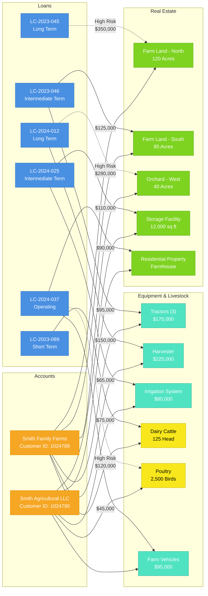
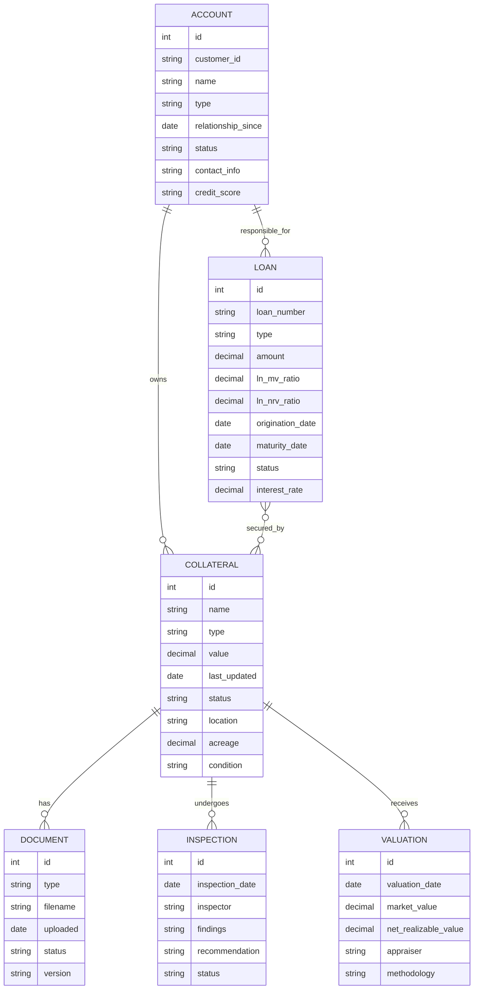

# Web of Liability Entity Relationships

This diagram illustrates the relationship structure between loans, collateral, and accounts in the Farm Credit Collateral Management System.



## Data Model Relationship Overview

This diagram shows how different entities in the Farm Credit Collateral Management System relate to each other in a data model perspective.



## Loan Risk Assessment Flow

This diagram illustrates the different states a collateral item can go through in the risk assessment process.

```mermaid
stateDiagram-v2
    [*] --> Normal: Initial Assessment
    
    state "Risk Assessment" as RA
    Normal --> RA: Periodic Review
    
    state "Value Assessment" as VA {
        Appraisal --> MarketValue
        Appraisal --> NetRealizableValue
        MarketValue --> LNtoMVCalculation
        NetRealizableValue --> LNtoNRVCalculation
    }
    
    RA --> VA: Valuation Required
    
    VA --> Normal: Acceptable Ratios
    VA --> HighRisk: LN/MV ratio > 75%
    VA --> Warning: Valuation outdated
    
    HighRisk --> Normal: Collateral value increases
    Warning --> Normal: Valuation updated
    HighRisk --> Warning: Valuation outdated
    Warning --> HighRisk: LN/MV ratio evaluated > 75% 
    
    Normal --> AdditionalCollateralRequired: LN/MV > 90%
    HighRisk --> AdditionalCollateralRequired: LN/MV > 90%
    
    AdditionalCollateralRequired --> Normal: Additional collateral secured
    
    Normal --> Foreclosure: Payment default > 90 days
    HighRisk --> Foreclosure: Payment default > 60 days
    Warning --> Foreclosure: Payment default > 90 days
    
    Foreclosure --> CollateralLiquidation: Legal proceedings complete
    CollateralLiquidation --> [*]: Collateral sold
