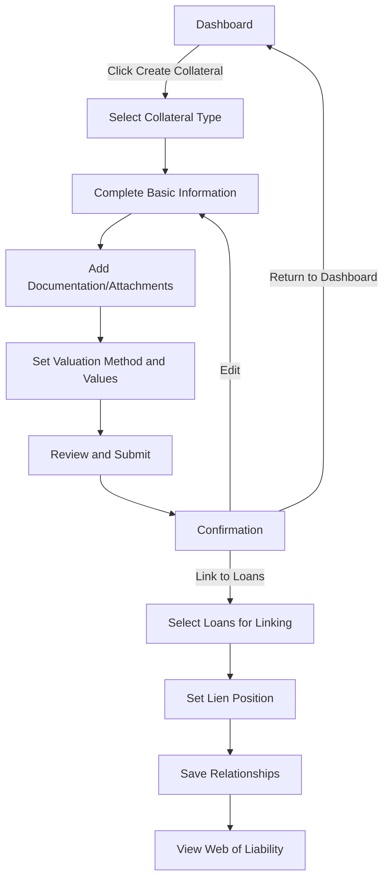
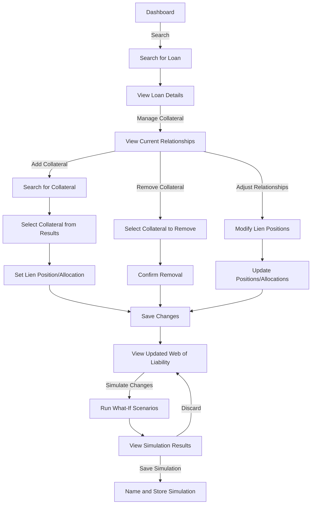
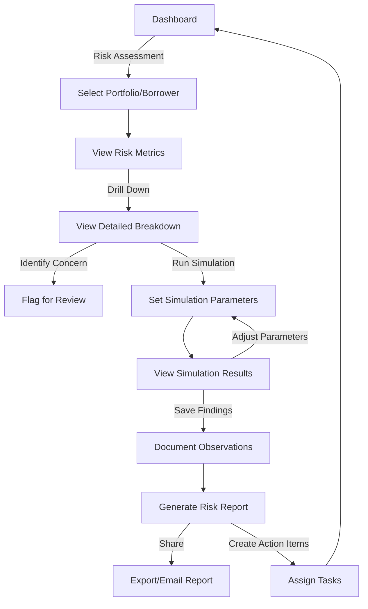
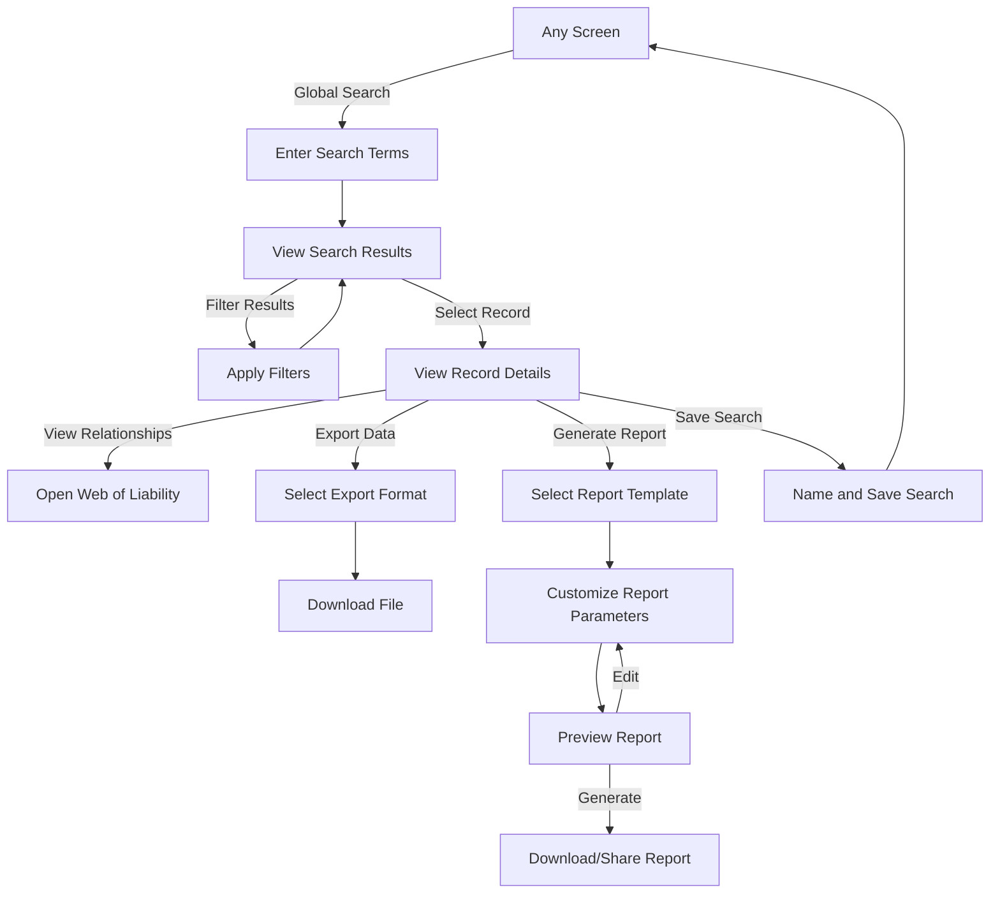
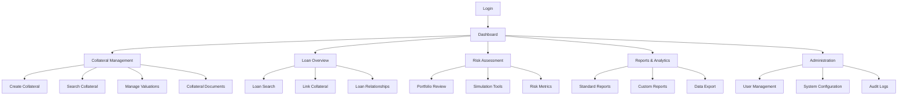
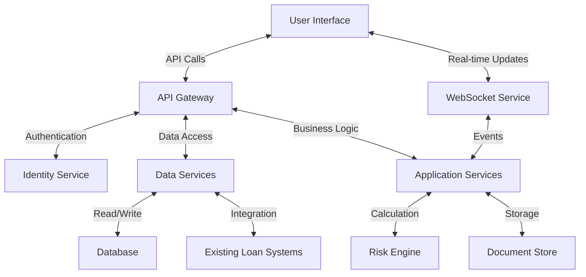
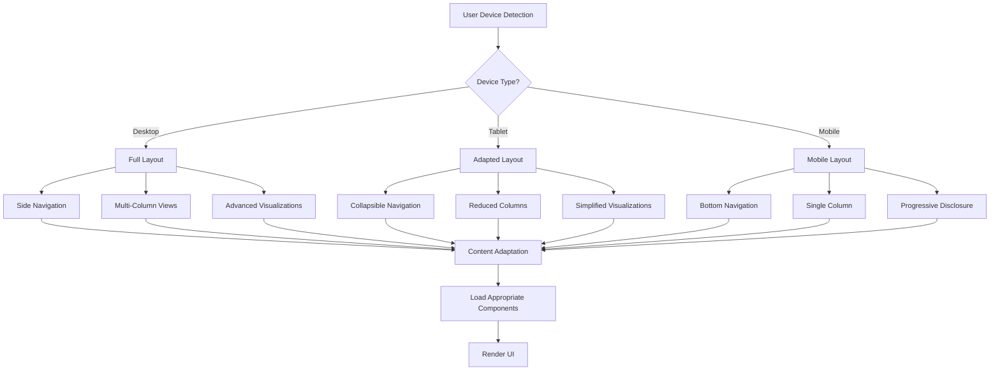

# Farm Credit Collateral Management System
## User Flow Diagrams

This document contains visual representations of the key user flows within the Farm Credit Collateral Management System. These diagrams help illustrate how users navigate through the system to complete their primary tasks.

## 1. Collateral Creation & Management Flow



## 2. Loan-Collateral Relationship Management Flow



## 3. Risk Assessment Workflow



## 4. Search & Reporting Flow



## 5. System Navigation Map



## 6. Component Interaction Diagram



## 7. Responsive Design Adaptation Flow



## 8. Web of Liability Node Interaction

```mermaid
flowchart TD
    A[Web of Liability View] --> B[Node Selection]
    B --> C{Node Type?}
    
    C -->|Loan| D[View Loan Details]
    C -->|Collateral| E[View Collateral Details]
    C -->|Account| F[View Account Details]
    C -->|Document| G[View Document Details]
    
    D & E & F & G --> H[View Related Nodes]
    H --> I[Secondary Selection]
    I --> J[Compare Relationship]
    
    B -->|Edge Selection| K[View Relationship Details]
    K --> L[Edit Relationship]
    L --> M[Update Graph]
    
    B -->|Multi-Select| N[Batch Actions]
    N --> O[Compare Selected]
    N --> P[Generate Report]
