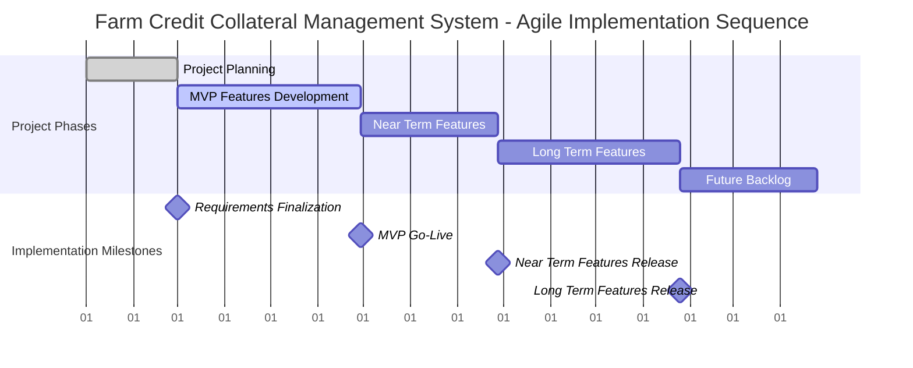
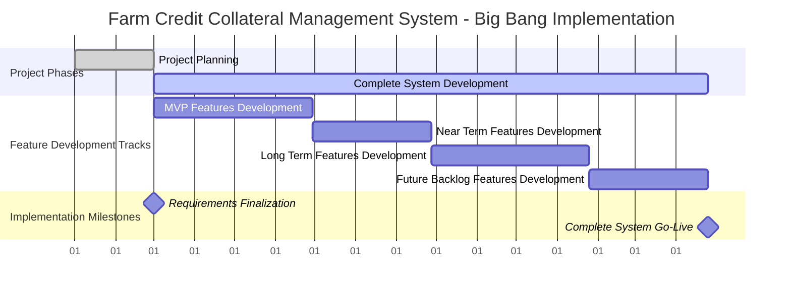
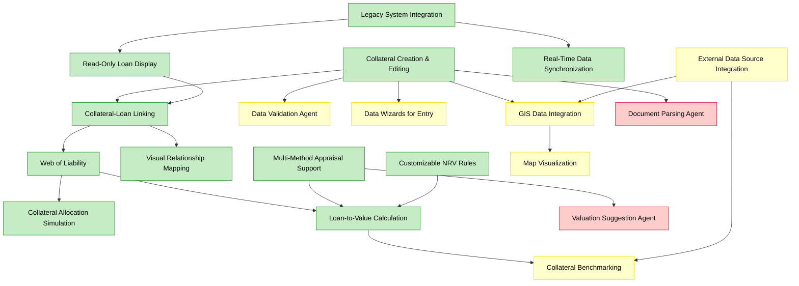
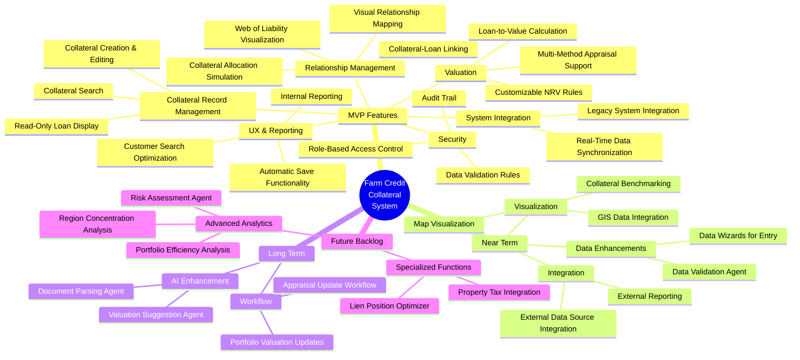
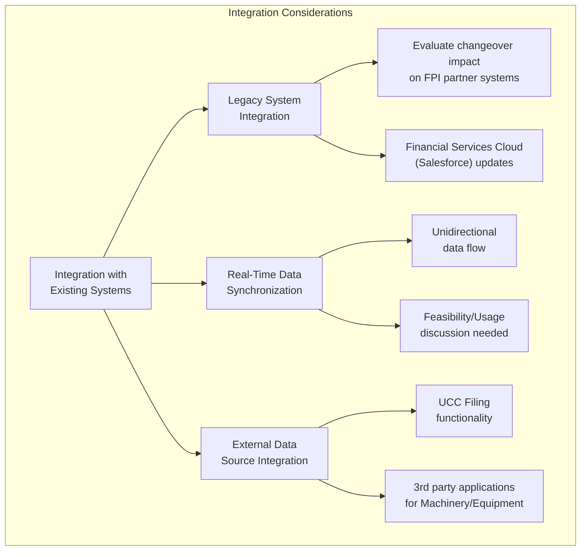
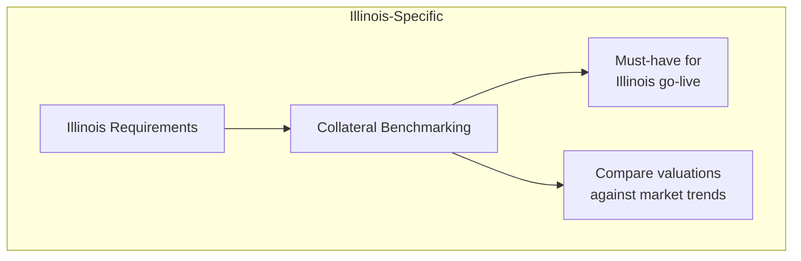
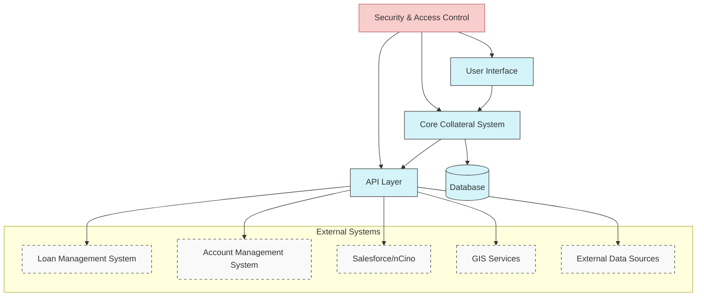

# Farm Credit Collateral Management System - Project Visualization

This document provides visual representations of the project structure, feature groupings, dependencies, and implementation sequence for the Farm Credit Collateral Management System.

## Release Approaches

### Agile Release Approach

### Big Bang Release Approach

## Feature Relationship Diagram

```mermaid
flowchart TD
    classDef mvpFeature fill:#c6ecc6,stroke:#228B22,color:black
    classDef nearTerm fill:#ffffcc,stroke:#FFD700,color:black
    classDef longTerm fill:#ffcccc,stroke:#DC143C,color:black
    classDef backlog fill:#e0e0e0,stroke:#696969,color:black
    
    %% Main Application Modules
    APP[Farm Credit Collateral Management System] --> RM[Record Management]
    APP --> RLM[Relationship Management]
    APP --> VAL[Valuation and Risk]
    APP --> GIS[GIS and Spatial]
    APP --> RPT[Reporting]
    APP --> WF[Workflow Automation]
    APP --> AI[AI Integration]
    APP --> UX[User Experience]
    APP --> INT[System Integration]
    APP --> SEC[Security & Compliance]
    
    %% Record Management
    RM --> CE[Collateral Creation & Editing]:::mvpFeature
    RM --> RO[Read-Only Loan Display]:::mvpFeature
    RM --> CS[Collateral Search]:::mvpFeature
    
    %% Relationship Management
    RLM --> CL[Collateral-Loan Linking]:::mvpFeature
    RLM --> VIS[Visualizations]:::mvpFeature
    RLM --> CAS[Collateral Allocation Simulation]:::mvpFeature
    
    VIS --> WOL[Web of Liability]:::mvpFeature
    VIS --> VRM[Visual Relationship Mapping]:::mvpFeature
    
    %% Valuation
    VAL --> MAS[Multi-Method Appraisal Support]:::mvpFeature
    VAL --> NRV[Customizable NRV Rules]:::mvpFeature
    VAL --> LTV[Loan-to-Value Calculation]:::mvpFeature
    VAL --> CB[Collateral Benchmarking]:::nearTerm
    
    %% GIS
    GIS --> GDI[GIS Data Integration]:::nearTerm
    GIS --> MVO[Map Visualization]:::nearTerm
    GIS --> RCA[Region Concentration Analysis]:::backlog
    
    %% Reporting
    RPT --> IR[Internal Reporting]:::mvpFeature
    RPT --> ER[External Reporting]:::nearTerm
    RPT --> PT[Property Tax Integration]:::backlog
    
    %% Workflow
    WF --> AUW[Appraisal Update Workflow]:::longTerm
    WF --> PVU[Portfolio Valuation Updates]:::longTerm
    WF --> PEA[Portfolio Efficiency Analysis]:::backlog
    
    %% AI Integration
    AI --> DVA[Data Validation Agent]:::nearTerm
    AI --> VSA[Valuation Suggestion Agent]:::longTerm
    AI --> DPA[Document Parsing Agent]:::longTerm
    AI --> LPO[Lien Position Optimizer]:::backlog
    AI --> RAA[Risk Assessment Agent]:::backlog
    
    %% UX
    UX --> ASF[Automatic Save Functionality]:::mvpFeature
    UX --> CSO[Customer Search Optimization]:::mvpFeature
    UX --> DWE[Data Wizards for Entry]:::nearTerm
    
    %% Integration
    INT --> LSI[Legacy System Integration]:::mvpFeature
    INT --> EDSI[External Data Source Integration]:::nearTerm
    INT --> RTDS[Real-Time Data Synchronization]:::mvpFeature
    
    %% Security
    SEC --> RBAC[Role-Based Access Control]:::mvpFeature
    SEC --> AT[Audit Trail]:::mvpFeature
    SEC --> DVR[Data Validation Rules]:::mvpFeature
    
    %% Dependencies
    CL --> WOL
    WOL --> CAS
    NRV --> LTV
    MAS --> LTV
    WOL --> LTV
    GDI --> MVO
    LSI --> RTDS
    DVA --> DVR
    
    %% Illinois Requirement
    subgraph Illinois["Illinois-Specific Requirements"]
        CB
    end
```

## Feature Dependency Matrix

## Feature Categorization by Release and Type

## Implementation Considerations

### Integration Challenges

### Illinois-Specific Requirements

## System Architecture Diagram

## Legend

* **MVP Features** - Must Have Features (Green)
* **Near Term** - Nice to Have Features (Yellow)
* **Long Term** - Nice to Have Features (Red)
* **Backlog** - Future Release Features (Gray)
