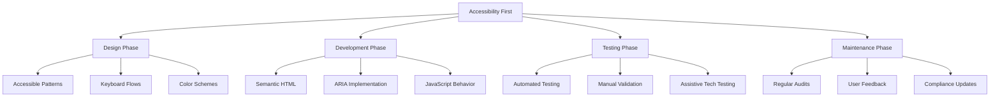
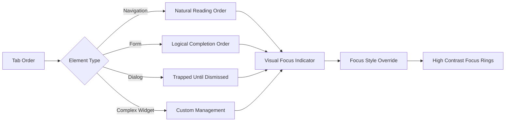
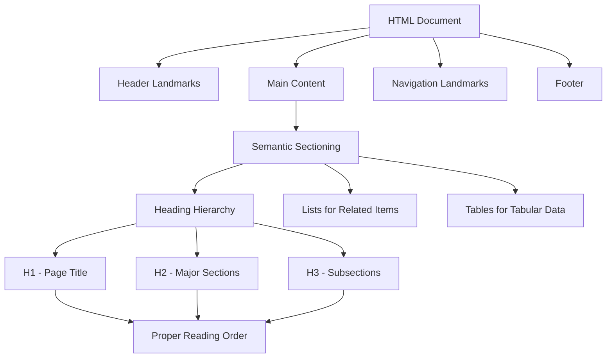
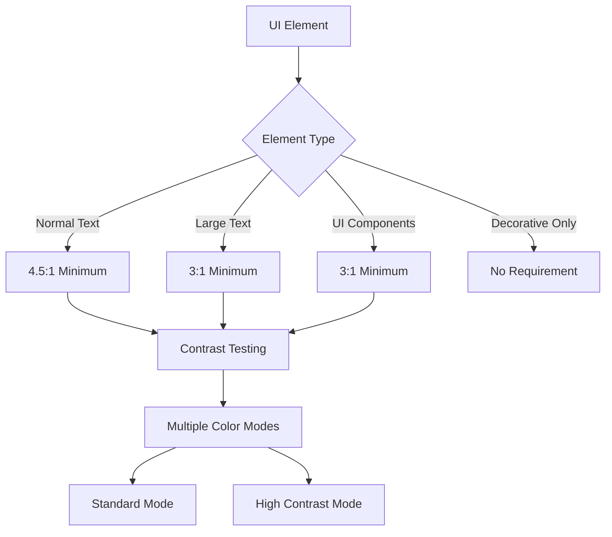
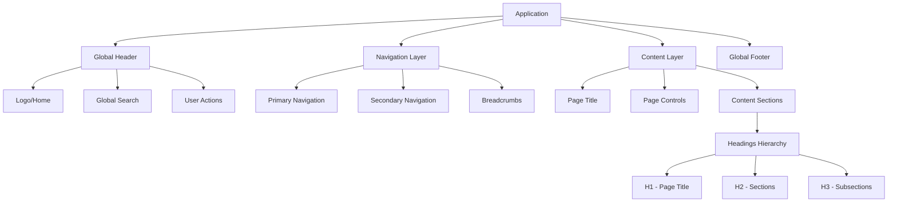
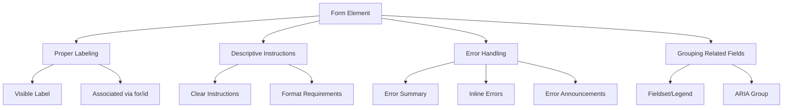
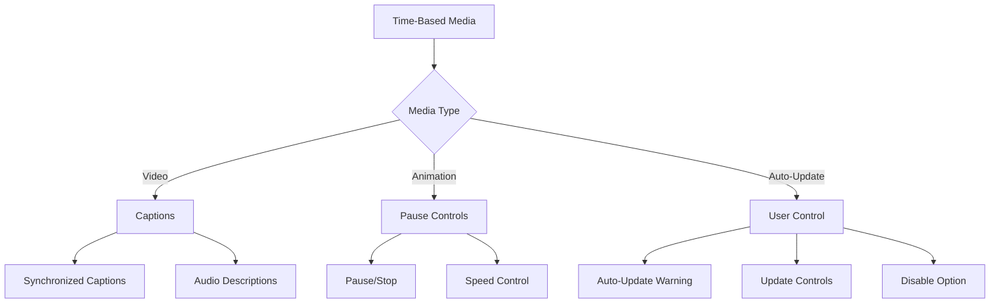
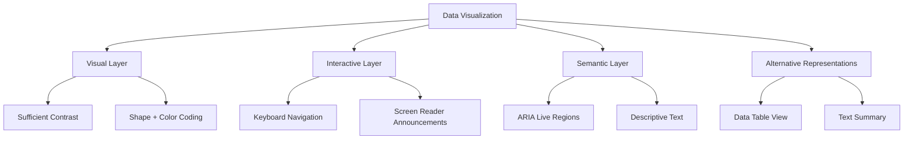
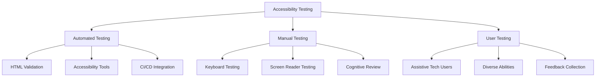

# Farm Credit Collateral Management System
## Accessibility Specifications

This document outlines the accessibility requirements and implementation guidelines for the Farm Credit Collateral Management System, ensuring compliance with WCAG 2.1 AA standards.

## Table of Contents
1. [Accessibility Standards & Approach](#accessibility-standards--approach)
2. [Keyboard Accessibility](#keyboard-accessibility)
3. [Screen Reader Compatibility](#screen-reader-compatibility)
4. [Color and Contrast](#color-and-contrast)
5. [Content Structure and Navigation](#content-structure-and-navigation)
6. [Forms and Interactive Elements](#forms-and-interactive-elements)
7. [Time-Based Media](#time-based-media)
8. [Visualization Accessibility](#visualization-accessibility)
9. [Testing and Compliance Validation](#testing-and-compliance-validation)

---

## Accessibility Standards & Approach

The Farm Credit Collateral Management System adheres to Web Content Accessibility Guidelines (WCAG) 2.1 Level AA standards, with the following approach:



### Guiding Principles

1. **Perceivable** - Information and user interface components must be presentable to users in ways they can perceive
2. **Operable** - User interface components and navigation must be operable by all users
3. **Understandable** - Information and operation of the user interface must be understandable
4. **Robust** - Content must be robust enough to be interpreted by a wide variety of user agents, including assistive technologies

---

## Keyboard Accessibility

All functionality must be accessible via keyboard, without requiring specific timing for individual keystrokes.

### Focus Management



### Implementation Requirements

1. **Tab Order**
   - Logical navigation sequence following visual layout
   - Skip navigation links at the beginning of each page
   - Focus trapping in modals and dialogs

2. **Focus Indicators**
   - Visible focus state for all interactive elements (2px blue border + light blue outline)
   - Enhanced focus styles in high contrast mode
   - Custom focus management for complex widgets (dropdown, data grid)

3. **Keyboard Shortcuts**
   - All shortcuts must have alternative means of execution
   - No single-key shortcuts without modifier keys
   - Documentation of all keyboard shortcuts in help section

4. **Example Code Pattern**
   ```html
   <!-- Skip link example -->
   <a href="#main-content" class="skip-link">Skip to main content</a>
   
   <!-- Focus management for custom widget -->
   <div role="listbox" tabindex="0" aria-activedescendant="selected-option">
     <div id="option-1" role="option">Option 1</div>
     <div id="option-2" role="option">Option 2</div>
     <div id="selected-option" role="option" aria-selected="true">Option 3</div>
   </div>
   ```

---

## Screen Reader Compatibility

The system is designed for compatibility with major screen readers including JAWS, NVDA, VoiceOver, and TalkBack.

### Semantic Structure



### ARIA Implementation Guidelines

1. **Landmarks**
   - Use HTML5 semantic elements with ARIA landmark roles as backup
   - Each page requires: `banner`, `navigation`, `main`, `contentinfo`
   - Additional contextual landmarks: `search`, `form`, `region`

2. **Dynamic Content Updates**
   - Live regions for important updates (`aria-live`)
   - Status messages: `aria-live="polite"` or `aria-live="assertive"`
   - Notification handling with appropriate politeness levels

3. **Custom Components**
   - Follow established ARIA patterns for complex widgets
   - Properly manage focus and state announcements
   - Test with multiple screen readers

4. **Example Code Pattern**
   ```html
   <!-- Status message implementation -->
   <div class="alert" role="alert" aria-live="assertive">
     Collateral record saved successfully.
   </div>
   
   <!-- Custom tabs implementation -->
   <div role="tablist">
     <button id="tab-1" role="tab" aria-selected="true" aria-controls="panel-1">Details</button>
     <button id="tab-2" role="tab" aria-selected="false" aria-controls="panel-2">Valuation</button>
   </div>
   <div id="panel-1" role="tabpanel" aria-labelledby="tab-1">
     <!-- Content here -->
   </div>
   <div id="panel-2" role="tabpanel" aria-labelledby="tab-2" hidden>
     <!-- Content here -->
   </div>
   ```

---

## Color and Contrast

All text and visual elements must have sufficient contrast and not rely solely on color for meaning.

### Contrast Requirements



### Implementation Requirements

1. **Text Contrast**
   - Normal text (smaller than 18pt): 4.5:1 minimum contrast ratio
   - Large text (18pt+ or 14pt+ bold): 3:1 minimum contrast ratio
   - All essential text remains visible in high contrast mode

2. **UI Components**
   - Interactive elements have 3:1 minimum contrast against adjacent colors
   - Focus indicators have 3:1 minimum contrast
   - State changes (hover, active, selected) maintain sufficient contrast

3. **Color Independence**
   - Information conveyed by color is also available through text or iconography
   - Status indicators include symbols, not just color
   - Form validation errors indicated by icons and text, not just color

4. **Color Scheme Variations**
   - Standard color scheme (meets all contrast requirements)
   - High contrast mode (enhanced contrast for all elements)
   - Option to reduce motion/animations

---

## Content Structure and Navigation

The application uses a clear, consistent structure with multiple navigation methods.

### Page Structure



### Implementation Requirements

1. **Navigation Methods**
   - Multiple ways to find content (navigation menu, search, sitemap)
   - Consistent placement of navigation elements
   - Breadcrumbs for context and navigation

2. **Content Organization**
   - Logical heading structure (single H1, followed by H2, H3, etc.)
   - Related information grouped with appropriate headings
   - Lists used for sets of related items

3. **Document Structure**
   - Semantic HTML5 elements throughout (`header`, `nav`, `main`, `section`, `article`, `aside`, `footer`)
   - ARIA landmarks for legacy browser support
   - Descriptive page titles following pattern: "Page Name | Section | Farm Credit Collateral System"

4. **Example Code Pattern**
   ```html
   <header role="banner">
     <a href="/">
       
     </a>
     <div role="search">
       <label for="global-search">Search</label>
       <input id="global-search" type="search">
     </div>
     <nav aria-label="User menu">
       <!-- User actions -->
     </nav>
   </header>
   
   <nav aria-label="Main navigation">
     <!-- Main nav items -->
   </nav>
   
   <main id="main-content" tabindex="-1">
     <h1>Collateral Details</h1>
     
     <nav aria-label="Breadcrumb">
       <ol>
         <li><a href="/">Home</a></li>
         <li><a href="/search">Search</a></li>
         <li aria-current="page">Collateral Details</li>
       </ol>
     </nav>
     
     <section aria-labelledby="details-heading">
       <h2 id="details-heading">Property Information</h2>
       <!-- Content here -->
     </section>
   </main>
   ```

---

## Forms and Interactive Elements

All forms and interactive elements are designed for accessibility across input methods.

### Form Design



### Implementation Requirements

1. **Form Controls**
   - All controls have visible, associated labels
   - Required fields clearly indicated (icon + text, not just color)
   - Instructions and hints provided before form completion
   - Sufficient spacing between interactive elements

2. **Error Handling**
   - Form validation errors summarized at top of form
   - Inline errors associated with specific fields
   - Error messages announced to screen readers
   - Clear instructions for correction

3. **Complex Controls**
   - Custom controls (dropdowns, date pickers) follow ARIA authoring practices
   - Alternative standard controls available when needed
   - Touch-friendly sizing (minimum 44×44px target)

4. **Example Code Pattern**
   ```html
   <form>
     <div role="alert" id="form-errors" aria-live="assertive" class="error-summary hidden">
       <!-- Validation errors will be inserted here -->
     </div>
     
     <div class="form-group">
       <label for="property-name" class="required">Property Name</label>
       <span id="property-name-hint" class="hint">Enter the legal or common name of the property</span>
       <input 
         type="text" 
         id="property-name" 
         name="propertyName"
         aria-required="true"
         aria-describedby="property-name-hint property-name-error"
       >
       <span id="property-name-error" class="error hidden"></span>
     </div>
     
     <fieldset>
       <legend>Property Type</legend>
       <div class="radio-group">
         <input type="radio" id="type-farmland" name="propertyType" value="farmland">
         <label for="type-farmland">Farmland</label>
       </div>
       <div class="radio-group">
         <input type="radio" id="type-residential" name="propertyType" value="residential">
         <label for="type-residential">Residential</label>
       </div>
     </fieldset>
     
     <button type="submit">Save Property</button>
   </form>
   ```

---

## Time-Based Media

Any time-based media (animations, videos, etc.) include appropriate alternatives and controls.

### Media Accessibility



### Implementation Requirements

1. **Animations and Transitions**
   - Respect user preferences for reduced motion
   - Controls to pause, stop, or hide animations
   - Animations never auto-play for more than 5 seconds without user control

2. **Timing Controls**
   - No time limits for interactions, or ability to turn off/extend
   - Warning before session timeout with option to extend
   - No content that automatically updates without user control

3. **Media Controls**
   - Video players include accessible controls
   - Captions available for all video content
   - Transcripts available for all audio content

4. **Example Code Pattern**
   ```html
   <!-- Respecting reduced motion preferences -->
   <style>
     @media (prefers-reduced-motion: reduce) {
       .animation {
         animation: none;
         transition: none;
       }
     }
   </style>
   
   <!-- Video with captions -->
   <figure>
     <video controls>
       <source src="tutorial.mp4" type="video/mp4">
       <track kind="captions" src="tutorial-captions.vtt" srclang="en" label="English" default>
       Your browser does not support the video element.
     </video>
     <figcaption>
       Tutorial: Creating a new collateral record
       <a href="tutorial-transcript.html">View Transcript</a>
     </figcaption>
   </figure>
   ```

---

## Visualization Accessibility

The Web of Liability and other data visualizations include accessible alternatives.

### Visualization Accessibility Layers



### Implementation Requirements

1. **Web of Liability Visualization**
   - Keyboard navigation between nodes
   - Screen reader support for node information
   - Data table alternative view
   - Text summary of key relationships
   - Node identification by shape and color (not just color)

2. **Charts and Graphs**
   - Alt text describing chart purpose and trends
   - Data tables available as alternatives
   - Sufficient color contrast between data series
   - Patterns/textures in addition to colors

3. **Interactive Visualizations**
   - Keyboard controls for all interactions
   - Focus management for selected elements
   - Text alternatives for state changes
   - ARIA live regions for dynamic updates

4. **Example Code Pattern**
   ```html
   <div class="visualization-container">
     <h2 id="web-title">Web of Liability: Smith Family Loans</h2>
     
     <!-- Controls -->
     <div class="viz-controls" role="toolbar" aria-label="Visualization controls">
       <button id="zoom-in">Zoom In</button>
       <button id="zoom-out">Zoom Out</button>
       <button id="reset-view">Reset View</button>
       <button id="show-table-view">Show as Table</button>
     </div>
     
     <!-- Visualization -->
     <div 
       id="visualization"
       role="application"
       aria-labelledby="web-title"
       tabindex="0"
     >
       <!-- Visualization will be rendered here -->
     </div>
     
     <!-- Text summary -->
     <details>
       <summary>Visualization Summary</summary>
       <div>
         <p>This visualization shows the Smith Family loan relationships with 3 primary loans secured by 5 pieces of collateral. The main property (Smith Farm) secures 2 loans, while equipment serves as collateral for a separate operating loan.</p>
       </div>
     </details>
     
     <!-- Data table alternative -->
     <div id="data-table-view" class="hidden">
       <table>
         <caption>Smith Family Loans and Collateral</caption>
         <thead>
           <tr>
             <th>Item Type</th>
             <th>Name</th>
             <th>Value</th>
             <th>Relationships</th>
           </tr>
         </thead>
         <tbody>
           <!-- Data rows -->
         </tbody>
       </table>
     </div>
   </div>
   ```

---

## Testing and Compliance Validation

A comprehensive testing strategy ensures ongoing accessibility compliance.

### Testing Framework



### Implementation Requirements

1. **Automated Testing**
   - Axe or similar integrated into build pipeline
   - Regular full-site audits with automated tools
   - Accessibility linting in development environment

2. **Manual Testing**
   - Keyboard-only testing for all features
   - Testing with multiple screen readers (JAWS, NVDA, VoiceOver)
   - Testing with screen magnification
   - Color contrast verification

3. **Test Documentation**
   - Accessibility test plan for each feature
   - Documented test cases for common user journeys
   - Compliance checklist against WCAG 2.1 AA requirements

4. **Testing Schedule**
   - Accessibility review at design phase
   - Developer testing during implementation
   - QA verification before release
   - Periodic full application review
