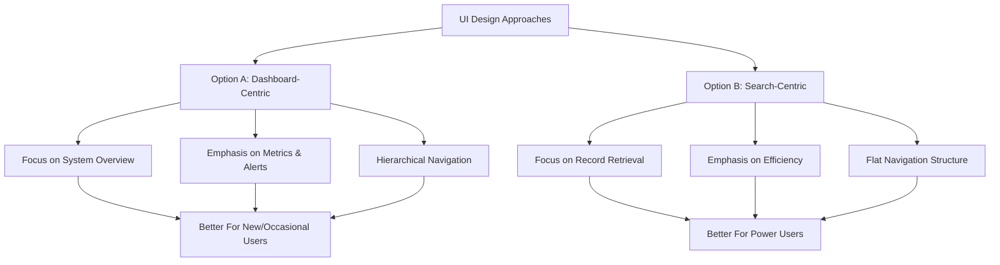
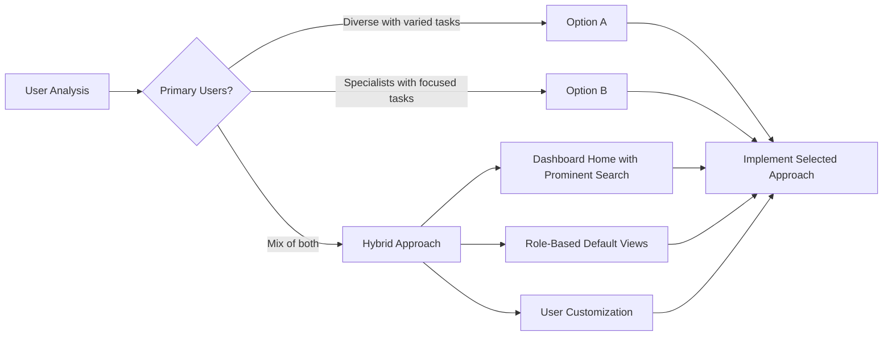

# Farm Credit Collateral Management System
## Alternative Design Concepts

This document provides detailed visual concepts for two alternative design approaches for the Farm Credit Collateral Management System, along with strengths, weaknesses, and implementation considerations for each.

## Table of Contents
1. [Design Approach Comparison](#design-approach-comparison)
2. [Option A: Dashboard-Centric Design](#option-a-dashboard-centric-design)
3. [Option B: Search-Centric Design](#option-b-search-centric-design)
4. [Decision Matrix](#decision-matrix)

---

## Design Approach Comparison



---

## Option A: Dashboard-Centric Design

The Dashboard-Centric approach puts emphasis on system-wide metrics, recent activity, and guided workflows, making it ideal for users who need a broad view of the system or who may be less familiar with specific record retrieval paths.

### Key Screens

#### Home Dashboard

```
+----------------------------------------------------------+
| LOGO | Search                         | Notif | Profile  |
+------+----------------------------------------------+----+
|      |                                              |    |
|  N   |  DASHBOARD                                   |    |
|  A   |                                              |    |
|  V   |  +---------------+  +---------------+        |    |
|      |  | Loan Summary  |  | Recent Items  |        |  P |
|  S   |  | $12.5M Total  |  | - Smith Farm  |        |  E |
|  I   |  | 45 Active     |  | - Jones Loan  |        |  R |
|  D   |  +---------------+  +---------------+        |  S |
|  E   |                                              |  O |
|  B   |  +---------------+  +---------------+        |  N |
|  A   |  | Risk Metrics  |  | Tasks         |        |  A |
|  R   |  | 15 High Risk  |  | 8 Pending     |        |  L |
|      |  | 3 Overdue     |  | 3 Urgent      |        |    |
|      |  +---------------+  +---------------+        |  B |
|      |                                              |  A |
|      |  +--------------------------------------+    |  R |
|      |  |                                      |    |    |
|      |  |  Web of Liability - Top Borrowers    |    |    |
|      |  |  [Interactive Visualization]         |    |    |
|      |  |                                      |    |    |
|      |  +--------------------------------------+    |    |
|      |                                              |    |
+------+----------------------------------------------+----+
```

#### Collateral Hub

```
+----------------------------------------------------------+
| LOGO | Search                         | Notif | Profile  |
+------+----------------------------------------------+----+
|      |                                              |    |
|  N   |  COLLATERAL HUB                              |    |
|  A   |                                              |    |
|  V   |  +---------------+  +---------------+        |    |
|      |  | Create New    |  | Import Data   |        |  P |
|  S   |  | Collateral    |  |               |        |  E |
|  I   |  +---------------+  +---------------+        |  R |
|  D   |                                              |  S |
|  E   |  QUICK ACCESS                                |  O |
|  B   |  +---------------+  +---------------+        |  N |
|  A   |  | Real Estate   |  | Equipment     |        |  A |
|  R   |  | 125 Items     |  | 78 Items      |        |  L |
|      |  +---------------+  +---------------+        |    |
|      |                                              |  B |
|      |  +---------------+  +---------------+        |  A |
|      |  | Livestock     |  | Other Assets  |        |  R |
|      |  | 32 Items      |  | 15 Items      |        |    |
|      |  +---------------+  +---------------+        |    |
|      |                                              |    |
|      |  MY RECENT COLLATERAL                        |    |
|      |  [Scrollable list of recent items]           |    |
|      |                                              |    |
+------+----------------------------------------------+----+
```

#### Web of Liability

```
+----------------------------------------------------------+
| LOGO | Search                         | Notif | Profile  |
+------+----------------------------------------------+----+
|      |                                              |    |
|  N   |  WEB OF LIABILITY > Smith Family             |    |
|  A   |                                              |    |
|  V   |  +--------------------------------------+    |    |
|      |  |                                      |    |  P |
|  S   |  |                                      |    |  A |
|  I   |  |              Visualization           |    |  N |
|  D   |  |                                      |    |  E |
|  E   |  |                                      |    |  L |
|  B   |  +--------------------------------------+    |    |
|  A   |                                              |    |
|  R   |  [Filters] [Zoom Controls] [Layout Options]  |    |
|      |                                              |    |
|      |  SUMMARY                                     |    |
|      |  +-------------------+  +----------------+   |    |
|      |  | Loans: 3          |  | Risk Level: Med|   |    |
|      |  | Collateral: 5     |  | LTV: 65%       |   |    |
|      |  | Value: $850,000   |  | Exp: 2028      |   |    |
|      |  +-------------------+  +----------------+   |    |
|      |                                              |    |
+------+----------------------------------------------+----+
```

### Strengths

1. **Comprehensive Overview** - Provides immediate visibility into system-wide metrics and status
2. **Guided Workflows** - Clear pathways for different tasks with contextual guidance
3. **Activity Monitoring** - Emphasis on recent changes and pending work
4. **Visual Hierarchy** - Clear organization of information by importance
5. **Role Customization** - Dashboard can be tailored to different user roles

### Weaknesses

1. **Efficiency for Power Users** - May require more clicks for frequent record access
2. **Learning Curve** - More complex interface with multiple elements to understand
3. **Screen Real Estate** - Dashboard widgets compete for limited space
4. **Performance** - Multiple widgets may impact load times
5. **Information Overload** - Risk of overwhelming new users with too much data

---

## Option B: Search-Centric Design

The Search-Centric approach prioritizes rapid access to specific records and streamlined workflows, making it ideal for power users who know exactly what they're looking for and need to work efficiently.

### Key Screens

#### Home Screen

```
+----------------------------------------------------------+
| LOGO |            Global Search Bar           | Profile  |
+------+----------------------------------------------+----+
|      |                                              |    |
|      |  RECENT SEARCHES                             |    |
|      |  [Smith] [Farm Credit] [Loan #1234] [More>] |    |
|      |                                              |    |
|      |  QUICK ACTIONS                               |    |
|      |  +----------+  +----------+  +----------+    |    |
|      |  | New      |  | Import   |  | Reports  |    |    |
|      |  | Collat.  |  | Data     |  |          |    |    |
|      |  +----------+  +----------+  +----------+    |    |
|      |                                              |    |
|      |  FAVORITES                                   |    |
|  S   |  [Pinned items and saved searches]           |  N |
|  I   |                                              |  O |
|  D   |  RECENT ACTIVITY                             |  T |
|  E   |  [Timeline of recently viewed/edited items]  |  I |
|  B   |                                              |  F |
|  A   |                                              |  S |
|  R   |                                              |    |
|      |                                              |    |
+------+----------------------------------------------+----+
```

#### Search Results

```
+----------------------------------------------------------+
| LOGO |            Global Search Bar           | Profile  |
+------+----------------------------------------------+----+
|      |                                              |    |
|      |  SEARCH RESULTS: "Smith Farm"                |    |
|      |                                              |    |
|      |  FILTERS: [Type ▼] [Status ▼] [Value ▼] [+] |    |
|      |                                              |    |
|      |  +--------------------------------------+    |    |
|      |  | ⬚ Smith Farm North                   |    |    |
|      |  | Real Estate • $450,000 • Active      |    |    |
|      |  | Last Updated: 03/15/2025             |    |  N |
|      |  +--------------------------------------+    |  O |
|      |                                              |  T |
|      |  +--------------------------------------+    |  I |
|  S   |  | ⬚ Smith Farm South                   |    |  F |
|  I   |  | Real Estate • $325,000 • Active      |    |  S |
|  D   |  | Last Updated: 02/28/2025             |    |    |
|  E   |  +--------------------------------------+    |    |
|  B   |                                              |    |
|  A   |  +--------------------------------------+    |    |
|  R   |  | 🚜 Smith Farm Equipment              |    |    |
|      |  | Equipment • $175,000 • Active        |    |    |
|      |  | Last Updated: 01/10/2025             |    |    |
|      |  +--------------------------------------+    |    |
|      |                                              |    |
|      |  RESULTS: 1-3 of 5                     [>]  |    |
|      |                                              |    |
+------+----------------------------------------------+----+
```

#### Record Detail View

```
+----------------------------------------------------------+
| LOGO |            Global Search Bar           | Profile  |
+------+----------------------------------------------+----+
|      |                                              |    |
|      |  < Back to Results                           |    |
|      |                                              |    |
|      |  Smith Farm North                            |    |
|      |  [Edit] [Delete] [Web of Liability] [Report] |    |
|      |                                              |    |
|      |  +----------+----------------------------+   |    |
|      |  |          |                            |   |    |
|      |  |  TABS:   | PROPERTY DETAILS           |   |    |
|      |  |          |                            |   |    |
|      |  | Details  | Address: 123 County Rd     |   |  N |
|      |  |          | Marion, IL 62959           |   |  O |
|      |  | Value    |                            |   |  T |
|  S   |  |          | Type: Farmland             |   |  I |
|  I   |  | Loans    | Size: 85 acres             |   |  F |
|  D   |  |          |                            |   |  S |
|  E   |  | Docs     | Status: Active             |   |    |
|  B   |  |          | Added: 01/15/2025          |   |    |
|  A   |  | History  | Owner: Smith, John         |   |    |
|  R   |  |          |                            |   |    |
|      |  |          | Description:               |   |    |
|      |  |          | Primary tillable acreage   |   |    |
|      |  |          | with irrigation system.    |   |    |
|      |  +----------+----------------------------+   |    |
|      |                                              |    |
+------+----------------------------------------------+----+
```

### Strengths

1. **Efficiency** - Direct path to needed information with minimal clicks
2. **Simplicity** - Cleaner interface with less cognitive load
3. **Familiarity** - Search-driven paradigm familiar to most users
4. **Scalability** - Works well even with very large data sets
5. **Performance** - Potentially faster loading with fewer widgets

### Weaknesses

1. **Less Discovery** - Reduced visibility of system-wide metrics and status
2. **Knowledge Required** - Assumes users know what to search for
3. **Less Guidance** - Fewer contextual cues for new users
4. **Limited Overview** - Harder to spot patterns across the system
5. **Notification Visibility** - Important alerts may be less prominent

---

## Decision Matrix

The following decision matrix provides factors to consider when choosing between the two design approaches:

| Factor | Option A: Dashboard-Centric | Option B: Search-Centric |
|--------|------------------------------|--------------------------|
| **User Experience** | Better for new/occasional users | Better for power users |
| **Task Efficiency** | Optimized for exploration | Optimized for retrieval |
| **Learning Curve** | Steeper but more guided | Lower for search-savvy users |
| **Information Density** | Higher (more widgets) | Lower (focused content) |
| **System Performance** | Potentially slower initial load | Potentially faster initial load |
| **Mobile Adaptation** | More complex to adapt | Easier to adapt |
| **Role Suitability** | Better for managers/analysts | Better for specialists/operators |
| **Technical Complexity** | Higher (more components) | Lower (fewer components) |

### Recommendation



Based on the Farm Credit personas outlined, we recommend a **hybrid approach** that combines elements of both designs:

1. **Primary Recommendation: Dashboard-Centric with Enhanced Search**
   - Dashboard home screen with prominent, intelligent search
   - Role-based dashboard configurations
   - Quick access to frequent record types
   - Recent activity and alerts integrated into view
   - Progressive disclosure of complex visualizations

2. **Technical Implementation Plan**
   - Phase 1: Core search functionality and record views
   - Phase 2: Dashboard widgets and metrics
   - Phase 3: Advanced visualization integration
   - Phase 4: Personalization features
