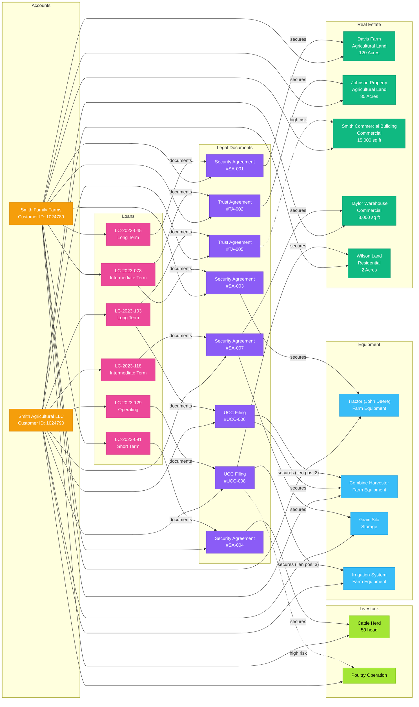
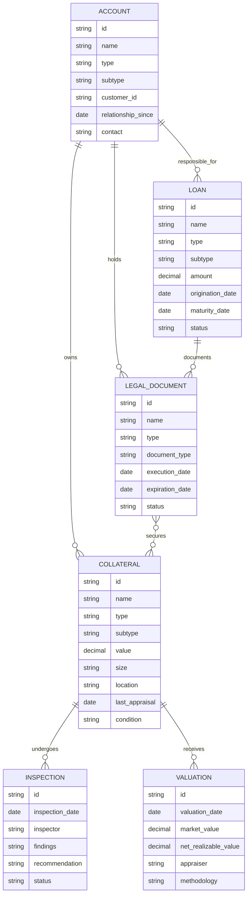

# Web of Liability Entity Relationships

This diagram illustrates the relationship structure between loans, legal documents, collateral, and accounts in the Farm Credit Collateral Management System.



## Data Model Relationship Overview

This diagram shows how different entities in the Farm Credit Collateral Management System relate to each other in a data model perspective, including the legal documents as intermediaries.



## Loan Risk Assessment Flow

This diagram illustrates the different states a collateral item can go through in the risk assessment process, with the addition of legal document review.

```mermaid
stateDiagram-v2
    [*] --> Normal: Initial Assessment
    
    state "Risk Assessment" as RA
    Normal --> RA: Periodic Review
    
    state "Document Verification" as DV {
        CheckLegalDocuments --> ValidateStatus
        ValidateStatus --> CheckExpiration
        CheckExpiration --> IdentifyGaps
    }
    
    RA --> DV: Document Review Required
    
    state "Value Assessment" as VA {
        Appraisal --> MarketValue
        Appraisal --> NetRealizableValue
        MarketValue --> LNtoMVCalculation
        NetRealizableValue --> LNtoNRVCalculation
    }
    
    RA --> VA: Valuation Required
    DV --> VA: Documents Valid
    
    VA --> Normal: Acceptable Ratios
    VA --> HighRisk: LN/MV ratio > 75%
    VA --> Warning: Valuation outdated
    
    DV --> DocumentWarning: Expiring documents
    DV --> DocumentIssue: Invalid documents
    DocumentWarning --> DV: Documents renewed
    DocumentIssue --> DV: Documents corrected
    
    HighRisk --> Normal: Collateral value increases
    Warning --> Normal: Valuation updated
    HighRisk --> Warning: Valuation outdated
    Warning --> HighRisk: LN/MV ratio evaluated > 75% 
    
    Normal --> AdditionalCollateralRequired: LN/MV > 90%
    HighRisk --> AdditionalCollateralRequired: LN/MV > 90%
    
    AdditionalCollateralRequired --> Normal: Additional collateral secured
    
    Normal --> Foreclosure: Payment default > 90 days
    HighRisk --> Foreclosure: Payment default > 60 days
    Warning --> Foreclosure: Payment default > 90 days
    DocumentIssue --> Foreclosure: Documents invalidated
    
    Foreclosure --> LegalDocumentPreparation: Initiate proceedings
    LegalDocumentPreparation --> CollateralLiquidation: Legal proceedings complete
    CollateralLiquidation --> [*]: Collateral sold
