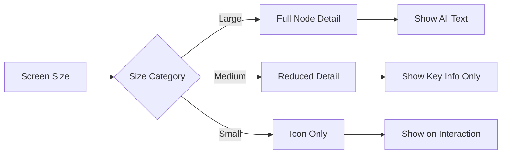

# Farm Credit Collateral Management System
## Node Visual Design Specifications

This document provides detailed specifications for the visual representation of different node types within the Web of Liability visualization, as well as detailed component designs for key interface elements.

## Table of Contents
1. [Node Type Design System](#node-type-design-system)
2. [Node Size and Hierarchy](#node-size-and-hierarchy)
3. [Connection Line Design](#connection-line-design)
4. [Node Interaction States](#node-interaction-states)
5. [Responsive Adaptation](#responsive-adaptation)
6. [Implementation Guidelines](#implementation-guidelines)

---

## Node Type Design System

Each node type in the Web of Liability visualization has a distinct visual design that provides immediate recognition and understanding of what the node represents.

### 1. Real Estate Collateral Nodes

```
+------------------+
|    ⌂             |
|    PROPERTY      |
|                  |
|  Smith Farm      |
|  $450,000        |
+------------------+
```

**Visual Characteristics:**
- Shape: Rectangle with slightly rounded corners
- Icon: House/property icon (⌂) prominently displayed
- Label: Property name with value beneath
- Color: #A5D6A7 (light green) fill, #2E7D32 (dark green) border
- Size: Variable based on value (larger for higher-value properties)

### 2. Equipment Collateral Nodes

```
+------------------+
|    🚜            |
|    EQUIPMENT     |
|                  |
|  2022 Tractor    |
|  $175,000        |
+------------------+
```

**Visual Characteristics:**
- Shape: Rectangle with rounded corners
- Icon: Tractor/machinery icon (🚜)
- Label: Equipment description with value beneath
- Color: #90CAF9 (light blue) fill, #1565C0 (dark blue) border
- Size: Variable based on value

### 3. Livestock Collateral Nodes

```
+------------------+
|    🐄            |
|    LIVESTOCK     |
|                  |
|  Cattle (50)     |
|  $125,000        |
+------------------+
```

**Visual Characteristics:**
- Shape: Rectangle with more pronounced rounded corners
- Icon: Animal icon appropriate to type (🐄, 🐖, etc.)
- Label: Livestock type with quantity and value
- Color: #FFCC80 (light orange) fill, #EF6C00 (dark orange) border
- Size: Variable based on value

### 4. Crops Collateral Nodes

```
+------------------+
|    🌾            |
|    CROPS         |
|                  |
|  Corn 2025       |
|  $85,000         |
+------------------+
```

**Visual Characteristics:**
- Shape: Rectangle with wavy top edge (crop-like)
- Icon: Crop-specific icon (🌾, 🌽, etc.)
- Label: Crop type with year and value
- Color: #FFF59D (light yellow) fill, #F9A825 (golden) border
- Size: Variable based on value

### 5. Legal Document Nodes

```
+------------------+
|    📄            |
|    DOCUMENT      |
|                  |
|  Mortgage        |
|  Filed: 03/2025  |
+------------------+
```

**Visual Characteristics:**
- Shape: Rectangle with folded corner (document-like)
- Icon: Document icon (📄)
- Label: Document type with filing date
- Color: #E1BEE7 (light purple) fill, #7B1FA2 (dark purple) border
- Size: Standard (not variable)

### 6. Loan Nodes

```
+------------------+
|    💰            |
|    LOAN          |
|                  |
|  #12345          |
|  $350,000        |
+------------------+
```

**Visual Characteristics:**
- Shape: Rectangle with more angular corners
- Icon: Money/loan icon (💰)
- Label: Loan ID with outstanding balance
- Color: #EF9A9A (light red) fill, #C62828 (dark red) border
- Size: Variable based on loan amount

### 7. Account/Entity Nodes

```
  +----------------+
 /                  \
|        👤          |
|      ACCOUNT       |
|                    |
|    Smith, John     |
|    Borrower        |
 \                  /
  +----------------+
```

**Visual Characteristics:**
- Shape: Hexagon or oval
- Icon: Person/entity icon (👤, 🏢)
- Label: Name with relationship type
- Color: #B3E5FC (light blue) fill, #0288D1 (dark blue) border
- Size: Standard (not variable)

---

## Node Size and Hierarchy

Nodes are sized according to a combination of importance, value, and available screen space:

### Size Calculation

- **Base Size**: All nodes have a minimum size to ensure readability
- **Value Scaling**: Nodes with higher monetary values are proportionally larger
- **Relationship Significance**: Nodes with more connections may be emphasized

### Visual Hierarchy Rules

1. Primary focus node (selected by user) is largest and most prominent
2. Directly connected nodes are second-tier size
3. Indirectly connected nodes are third-tier size
4. Distant relationships are smallest size

### Responsive Size Adjustment



## Connection Line Design

Connection lines between nodes visually communicate the nature and strength of relationships:

### Line Types

1. **Primary Connection** (Loan to Direct Collateral)
   - Thick solid line
   - Color based on loan type/risk
   - Direction indicated by subtle arrow

2. **Secondary Connection** (Collateral to Account)
   - Medium thickness dashed line
   - Neutral color
   - Bi-directional indicator

3. **Tertiary Connection** (Related Entities)
   - Thin dotted line
   - Light neutral color
   - Optional directional indicator

### Connection Attributes

- **Line Weight**: Indicates importance of connection
- **Style**: Solid, dashed, or dotted to indicate relationship type
- **Color**: Indicates status (good standing, at risk, etc.)
- **Labels**: Optional floating labels on connections showing relationship type

---

## Node Interaction States

Nodes have multiple visual states to indicate interaction:

### 1. Default State
- Standard appearance as defined in node type design
- Moderate opacity
- Standard border weight

### 2. Hover State
- Slight increase in size (105%)
- Increased opacity
- Glowing effect on border
- Quick info tooltip appears

### 3. Selected State
- Increased size (110%)
- Full opacity
- Thicker border with highlight color
- Connected nodes and lines highlighted
- Unconnected nodes dimmed

### 4. Alert State
- Pulsing border
- Alert icon overlay
- Higher color saturation
- Priority positioning in layout

### 5. Filtered/Dimmed State
- Reduced opacity (30%)
- Grayscale color shift
- Reduced size (90%)
- Simplified detail

---

## Responsive Adaptation

The node visualization adapts to different screen sizes and devices:

### Desktop View (1200px+)
- Full node details visible
- Complete relationship map
- Interactive exploration with zoom/pan
- Side panel for detailed information

### Tablet View (768px-1199px)
- Simplified node design
- Focus on primary relationships
- Touch-optimized interaction
- Collapsible detail panels

### Mobile View (320px-767px)
- Focus on single node with immediate connections
- Sequential exploration (one level at a time)
- Swipe gestures for navigation
- Bottom sheet for details instead of side panel

### Touch Interaction Enhancement
- Larger touch targets on nodes
- Two-finger gesture for zoom
- Long press for context menu
- Edge swipe for navigation

---

## Implementation Guidelines

### Technical Recommendations

1. **Rendering Technology**
   - SVG-based rendering for scalability and crispness
   - Canvas option for large, complex graphs
   - WebGL for high-performance complex visualizations

2. **Layout Algorithms**
   - Force-directed graph for organic relationships
   - Hierarchical layout for organizational relationships
   - Radial layout for relationship exploration from central node

3. **Performance Optimization**
   - Level-of-detail rendering (simplify distant nodes)
   - Virtualization for large graphs
   - Progressive loading of relationship data
   - Edge bundling for complex relationships

### Animation Guidelines

1. **Transitions**
   - Smooth transitions between states (300-500ms)
   - Easing functions for natural movement
   - Staggered animations for groups of nodes

2. **Interactive Feedback**
   - Immediate visual feedback on hover/touch
   - Animated highlighting of connections
   - Smooth zoom/pan movements

### Accessibility Considerations

1. **Alternative Representations**
   - Table view option for screen readers
   - High-contrast mode
   - Keyboard navigation between nodes

2. **Interaction Support**
   - Voice commands for navigation
   - Screen reader descriptions of relationships
   - Tactile feedback for touch devices
